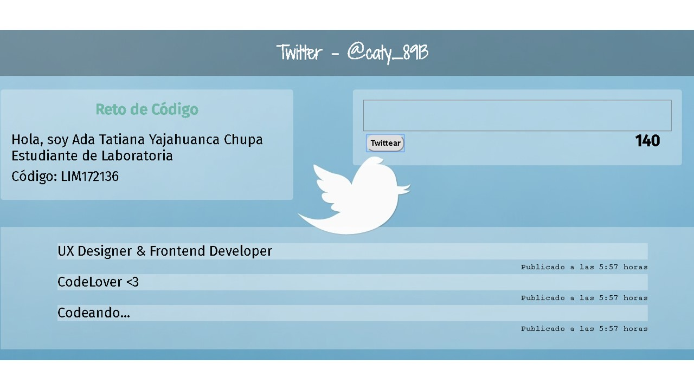

# Twitter
_____________

Twitter es un servicio online de comunicación, como lo sería la mensajería instantánea (messenger, etc.), los blogs, las páginas web, etc., pero limitado a que cada mensaje sólo admite hasta 140 caracteres y donde la gente, inicialmente, escribe respondiendo a una simple pregunta: ¿Qué estás haciendo?.

Pero no sólo se puede limitar a qué estás haciendo, sino que puedes interactuar con unos y otros, ya que cada usuario de Twitter “sigue” lo que escriben otros usuarios, así que la interactividad entre otros es como si fuera un enorme chat, pero con las ventajas de que entras cuando quieres, respondes cuando te apetece y lo que te apetece, ves sólo lo que escribe la gente a la que quieres seguir, puedes enviar mensajes privados, recibir gratis mensajes de una u otra forma en tu teléfono móvil, etc.

## Detalles adicionales
-Para esta aplicación se empleó : HTML5, CSS3 y Javascript.

  
  Cualquier consulta, duda o sugerencia puede realizarla al correo: adayc@hotmail.com
